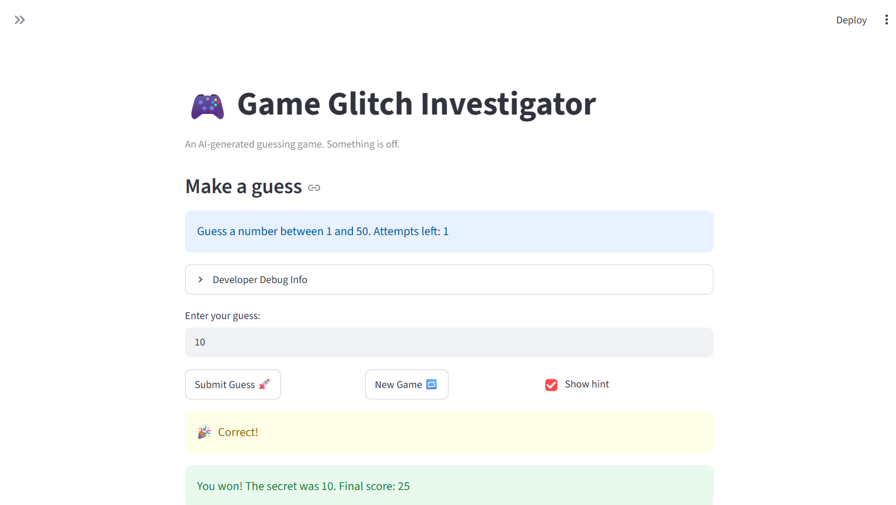

# 🎮 Game Glitch Investigator: The Impossible Guesser

## 🚨 The Situation

You asked an AI to build a simple "Number Guessing Game" using Streamlit.
It wrote the code, ran away, and now the game is unplayable. 

- You can't win.
- The hints lie to you.
- The secret number seems to have commitment issues.

## 🛠️ Setup

1. Install dependencies: `pip install -r requirements.txt`
2. Run the broken app: `python -m streamlit run app.py`

## 🕵️‍♂️ Your Mission

1. **Play the game.** Open the "Developer Debug Info" tab in the app to see the secret number. Try to win.
2. **Find the State Bug.** Why does the secret number change every time you click "Submit"? Ask ChatGPT: *"How do I keep a variable from resetting in Streamlit when I click a button?"*
3. **Fix the Logic.** The hints ("Higher/Lower") are wrong. Fix them.
4. **Refactor & Test.** - Move the logic into `logic_utils.py`.
   - Run `pytest` in your terminal.
   - Keep fixing until all tests pass!

## 📝 Document Your Experience

- [x] Describe the game's purpose.
- [x] Detail which bugs you found.
- [x] Explain what fixes you applied.

## 📸 Demo Walkthrough

Describe your fixed game in numbered steps so a reader can follow along without watching a video:

1. User can select a difficulty using the sidebar at the left (say correct answer is 12)
2. User enters a guess of 25
3. Game returns "Too High"
4. User enters a guess of 10 → "Too Low"
5. User enters a guess of 15 → "Too High"
5. Score decreases by 5 after each incorrect guess
6. Game ends after the correct guess (win, earns a substantial amount of points) or after running out of attempts (lose)

**Screenshot** *(optional)*:


## 🧪 Test Results

```
# Paste your pytest output here, e.g.:
# pytest tests/
# 
# ============================= test session starts ==============================
# platform linux -- Python 3.12.3, pytest-9.0.3, pluggy-1.6.0 -- /home/aabedin/CodePath/codepath_venv/bin/python
# cachedir: .pytest_cache
# rootdir: /home/aabedin/CodePath/ai110-module1show-gameglitchinvestigator-starter
# plugins: anyio-4.13.0
# collecting ... collected 52 items
# 
# tests/test_game_logic.py::test_winning_guess PASSED                      [  1%]
# tests/test_game_logic.py::test_winning_guess_off_boundary PASSED         [  3%]
# tests/test_game_logic.py::test_guess_one_above_is_too_high PASSED        [  5%]
# tests/test_game_logic.py::test_guess_one_below_is_too_low PASSED         [  7%]
# tests/test_game_logic.py::test_negative_numbers_compare_correctly PASSED [  9%]
# tests/test_game_logic.py::test_guess_too_high PASSED                     [ 11%]
# tests/test_game_logic.py::test_guess_too_low PASSED                      [ 13%]
# tests/test_game_logic.py::test_hint_too_high_says_go_lower PASSED        [ 15%]
# tests/test_game_logic.py::test_hint_too_low_says_go_higher PASSED        [ 17%]
# tests/test_game_logic.py::test_win_awards_points PASSED                  [ 19%]
# tests/test_game_logic.py::test_win_score_decreases_with_more_attempts PASSED [ 21%]
# tests/test_game_logic.py::test_win_score_never_below_10_bonus PASSED     [ 23%]
# tests/test_game_logic.py::test_too_high_subtracts_points PASSED          [ 25%]
# tests/test_game_logic.py::test_too_high_odd_attempt_subtracts PASSED     [ 26%]
# tests/test_game_logic.py::test_too_low_subtracts_points PASSED           [ 28%]
# tests/test_game_logic.py::test_unknown_outcome_unchanged PASSED          [ 30%]
# tests/test_game_logic.py::test_too_high_and_too_low_subtract_same_amount PASSED [ 32%]
# tests/test_game_logic.py::test_win_on_first_attempt_awards_100 PASSED    [ 34%]
# tests/test_game_logic.py::test_win_adds_to_existing_score PASSED         [ 36%]
# tests/test_game_logic.py::test_subtracting_can_go_negative PASSED        [ 38%]
# tests/test_game_logic.py::test_empty_outcome_unchanged PASSED            [ 40%]
# tests/test_game_logic.py::test_easy_range PASSED                         [ 42%]
# tests/test_game_logic.py::test_normal_range PASSED                       [ 44%]
# tests/test_game_logic.py::test_hard_range PASSED                         [ 46%]
# tests/test_game_logic.py::test_unknown_difficulty_defaults_to_hard_range PASSED [ 48%]
# tests/test_game_logic.py::test_difficulty_is_case_sensitive PASSED       [ 50%]
# tests/test_game_logic.py::test_parse_valid_integer PASSED                [ 51%]
# tests/test_game_logic.py::test_parse_negative_integer PASSED             [ 53%]
# tests/test_game_logic.py::test_parse_float_string_truncates PASSED       [ 55%]
# tests/test_game_logic.py::test_parse_none_returns_error PASSED           [ 57%]
# tests/test_game_logic.py::test_parse_empty_string_returns_error PASSED   [ 59%]
# tests/test_game_logic.py::test_parse_non_numeric_returns_error PASSED    [ 61%]
# tests/test_game_logic.py::test_parse_surrounding_whitespace_is_stripped PASSED [ 63%]
# tests/test_game_logic.py::test_parse_whitespace_only_is_not_a_number PASSED [ 65%]
# tests/test_game_logic.py::test_parse_leading_plus_sign PASSED            [ 67%]
# tests/test_game_logic.py::test_parse_underscore_separated_int PASSED     [ 69%]
# tests/test_game_logic.py::test_parse_scientific_notation_fails_without_dot PASSED [ 71%]
# tests/test_game_logic.py::test_parse_negative_float_truncates_toward_zero PASSED [ 73%]
# tests/test_game_logic.py::test_parse_leading_dot_float PASSED            [ 75%]
# tests/test_game_logic.py::test_parse_trailing_dot_float PASSED           [ 76%]
# tests/test_game_logic.py::test_parse_negative_leading_dot_truncates_to_zero PASSED [ 78%]
# tests/test_game_logic.py::test_parse_multiple_dots_fails PASSED          [ 80%]
# tests/test_game_logic.py::test_parse_dot_only_fails PASSED               [ 82%]
# tests/test_game_logic.py::test_win_floor_boundary_attempt_10_is_exactly_10 PASSED [ 84%]
# tests/test_game_logic.py::test_win_floor_boundary_attempt_11_floors_to_10 PASSED [ 86%]
# tests/test_game_logic.py::test_win_just_above_floor_attempt_9_awards_20 PASSED [ 88%]
# tests/test_game_logic.py::test_win_floor_applies_even_with_existing_score PASSED [ 90%]
# tests/test_game_logic.py::test_wrong_guess_from_negative_score_goes_more_negative PASSED [ 92%]
# tests/test_game_logic.py::test_full_workflow_parse_then_win PASSED       [ 94%]
# tests/test_game_logic.py::test_full_workflow_misses_then_win_accumulates_score PASSED [ 96%]
# tests/test_game_logic.py::test_full_workflow_invalid_input_does_not_advance_score PASSED [ 98%]
# tests/test_game_logic.py::test_full_workflow_hard_difficulty_upper_boundary_win PASSED [100%]
# 
# ============================== 52 passed in 0.10s ==============================
```

## 🚀 Stretch Features

- [ ] [If you choose to complete Challenge 4, describe the Enhanced UI changes here — a screenshot is optional]
